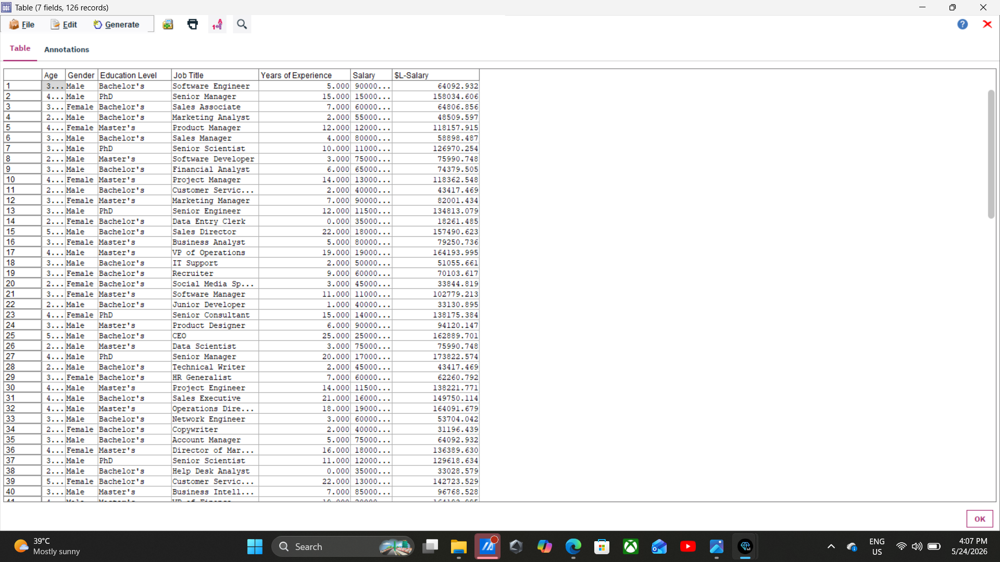
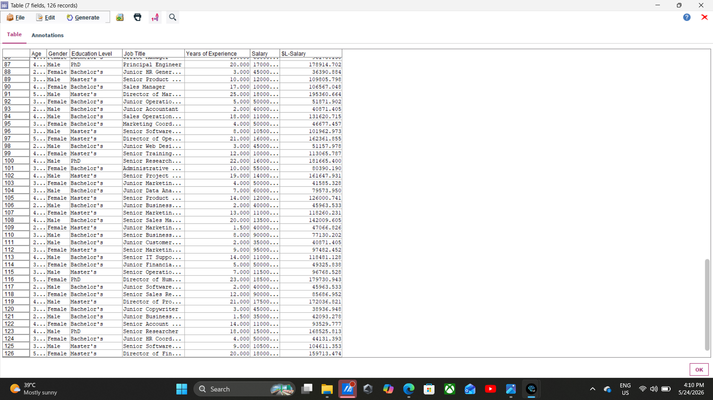

# Salary Prediction using IBM SPSS Modeler

Predictive Analytics-Based Salary Prediction System using IBM SPSS Modeler and Linear Regression Algorithm.

---

# 📌 Project Overview

This project is developed using IBM SPSS Modeler to predict employee salaries using Machine Learning and Predictive Analytics techniques.

The system analyzes employee-related attributes and generates salary prediction insights using the Linear Regression algorithm.

---

# 🎯 Objective

The objective of this project is to:

- Analyze salary-related data
- Predict employee salary values
- Identify factors affecting salary prediction
- Generate predictive analytics insights

---

# 🛠 Technologies Used

| Technology | Purpose |
|------------|---------|
| IBM SPSS Modeler | Predictive Analytics |
| Linear Regression | Prediction Modeling |
| Excel Dataset | Data Source |
| GitHub | Project Hosting |

---

# 📂 Dataset Information

The dataset contains salary-related attributes used for prediction and analysis.

---

# 🔄 Workflow

Excel Source  
↓  
Type Node  
↓  
Sample Node  
↓  
Linear Regression  
↓  
Gold Nugget  
↓  
Table Node  
↓  
Predicted Salary Output  

---

# ⚙️ Project Workflow Steps

## Step 1: Open IBM SPSS Modeler
Create a new stream workspace for the Salary Prediction project.

## Step 2: Import Dataset
Import the dataset using the File Source Node.

## Step 3: Add Type Node
Configure Salary as the Target field and remaining fields as Input fields.

## Step 4: Add Sample Node
Apply Random Sampling with 70% training data.

## Step 5: Add Modeling Node
Connect the Linear Regression Modeling Node.

## Step 6: Run the Model
Execute the model to train the salary prediction system.

## Step 7: Generate Model Nugget
IBM SPSS Modeler automatically generates the trained Model Nugget.

## Step 8: Add Table Node
Connect the Table Node for output visualization.

## Step 9: View Final Output
Run the Table Node to display predicted salary results.

---

# 📸 Output Screenshots

## Prediction Result

---

# 🔍 Key Findings

- The Linear Regression model successfully predicted salary values.
- Predictive analytics techniques were implemented using IBM SPSS Modeler.
- The project generated salary prediction insights and output analysis.

---

# ✅ Results

The predictive analytics model was successfully developed using IBM SPSS Modeler and Linear Regression techniques.

The system effectively analyzed salary-related data and generated prediction results.

---

# 🏁 Conclusion

This project demonstrates the practical implementation of predictive analytics and machine learning using IBM SPSS Modeler.

The Linear Regression model successfully predicts salary values based on input data attributes.

---

# 📁 Project Structure

Salary_Prediction/
│
├── model/
│   └── salary_Prediction_Proj.str
│
├── screenshots/
│   ├── OutputImage1.png
│   └── OutputImage2.png
│
├── dataset/
│   └── Salary_Data.xlsx
│
├── ppt/
│   └── SalaryPredProjPPT.pdf
│
└── README.md
