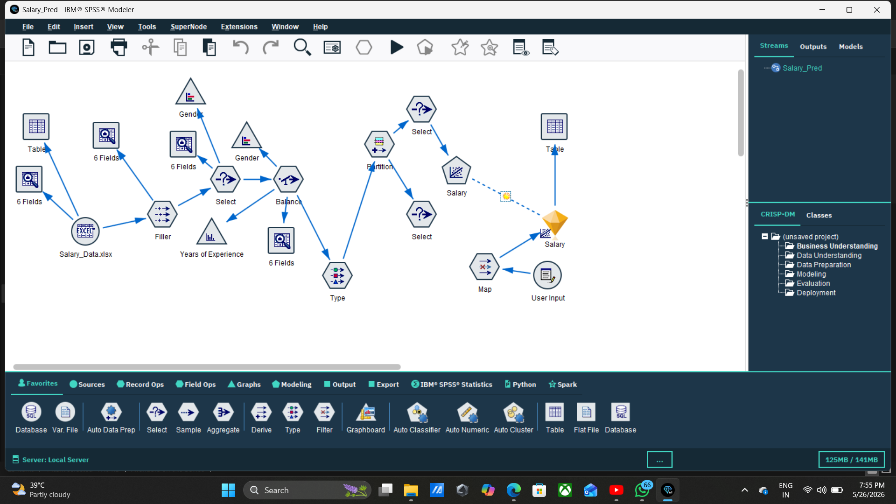
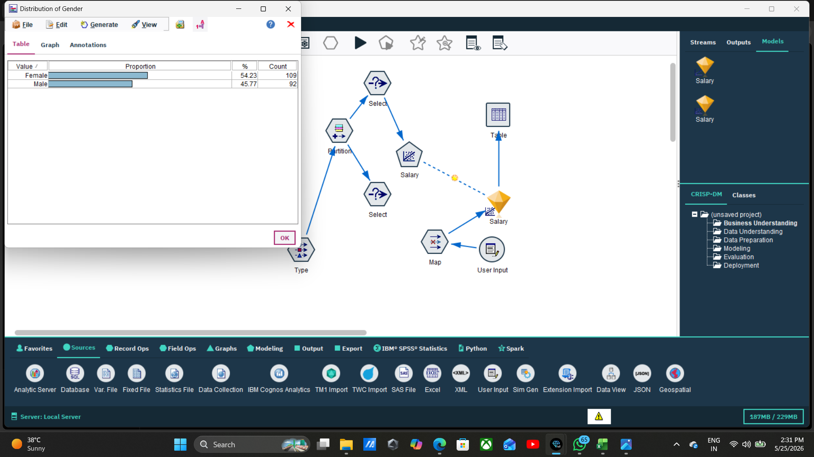
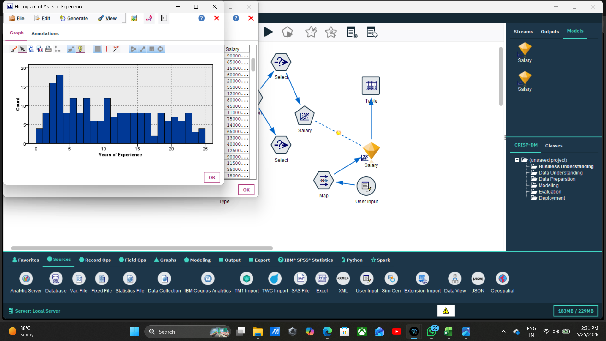
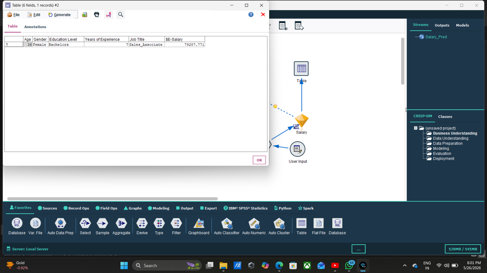

# Salary Prediction using IBM SPSS Modeler

Predictive Analytics-Based Salary Prediction System using IBM SPSS Modeler and Advanced Data Processing Nodes.

---

# 📌 Project Overview

This project is developed using IBM SPSS Modeler to predict employee salaries using Machine Learning and Predictive Analytics techniques.

The project analyzes salary-related data using multiple SPSS Modeler nodes such as Filler, Select, Balance, Type, Partition, Map, and Table Nodes to generate prediction insights and analytical outputs.

The workflow demonstrates data preparation, filtering, balancing, partitioning, modeling, and salary prediction processes in IBM SPSS Modeler.

---

# 🎯 Objective

The objective of this project is to:

- Analyze salary-related employee data
- Predict employee salary values
- Perform data preparation and balancing
- Generate predictive analytics insights
- Identify relationships between salary and employee attributes

---

# 🛠 Technologies Used

| Technology | Purpose |
|------------|---------|
| IBM SPSS Modeler | Predictive Analytics |
| Machine Learning | Salary Prediction |
| Excel Dataset | Data Source |
| GitHub | Project Hosting |

---

# 📂 Dataset Information

The dataset used in this project contains employee salary-related attributes and experience-based information for predictive analysis.

Dataset File:
- Salary_Data.xlsx

---

# 🔄 Workflow

Excel Source  
↓  
Filler Node  
↓  
Select Node  
↓  
Balance Node  
↓  
Type Node  
↓  
Partition Node  
↓  
Select Node  
↓  
Salary Modeling  
↓  
Map Node  
↓  
User Input  
↓  
Table Output  

---

# ⚙️ Project Workflow Steps

## Step 1: Open IBM SPSS Modeler
Create a new stream workspace for the Salary Prediction project.

## Step 2: Import Dataset
Import the Salary_Data.xlsx dataset using the Excel Source Node.

## Step 3: Apply Filler Node
Use the Filler Node to handle missing or incomplete values in the dataset.

## Step 4: Apply Select Nodes
Use Select Nodes to select specific employee records and attributes for analysis.

## Step 5: Apply Balance Node
Balance the dataset for improved analytical processing and data distribution.

## Step 6: Configure Type Node
Set Salary as the Target field and remaining fields as Input fields.

## Step 7: Apply Partition Node
Partition the dataset into training and testing data for predictive modeling.

## Step 8: Generate Salary Prediction Model
Run the salary prediction modeling process using IBM SPSS Modeler.

## Step 9: Apply Map Node and User Input
Use Map Node and User Input Node for customized prediction mapping and salary input processing.

## Step 10: Generate Final Output
Connect the Table Node to display the final predicted salary output.

---

# 📸 Output Screenshots

## Salary Prediction Workflow

## Output Result 1

## Output Result 2

## Final Prediction Output

---

# 🔍 Key Features

- Employee salary prediction system
- Advanced node-based workflow
- Data preparation using Filler Node
- Dataset balancing and partitioning
- Predictive analytics implementation
- Output visualization using Table Node

---

# ✅ Results

The predictive analytics model was successfully developed using IBM SPSS Modeler.

The system successfully processed employee salary-related data and generated salary prediction outputs using multiple analytical nodes and machine learning techniques.

---

# 🏁 Conclusion

This project demonstrates the practical implementation of predictive analytics and machine learning using IBM SPSS Modeler.

The workflow successfully integrates data preparation, balancing, partitioning, mapping, and predictive modeling techniques to generate salary prediction outputs and analytical insights.

---

# 📁 Project Structure

Salary_Prediction/
│
├── Salary_Pred.str
│
├── Salary_Data.xlsx
│
├── SalaryPredProjPPT.pdf
│
├── SalaryPredModelWorkflow.png
│
├── output1.png
│
├── output2.png
│
├── FinalOutputimage.png
│
└── README.md
